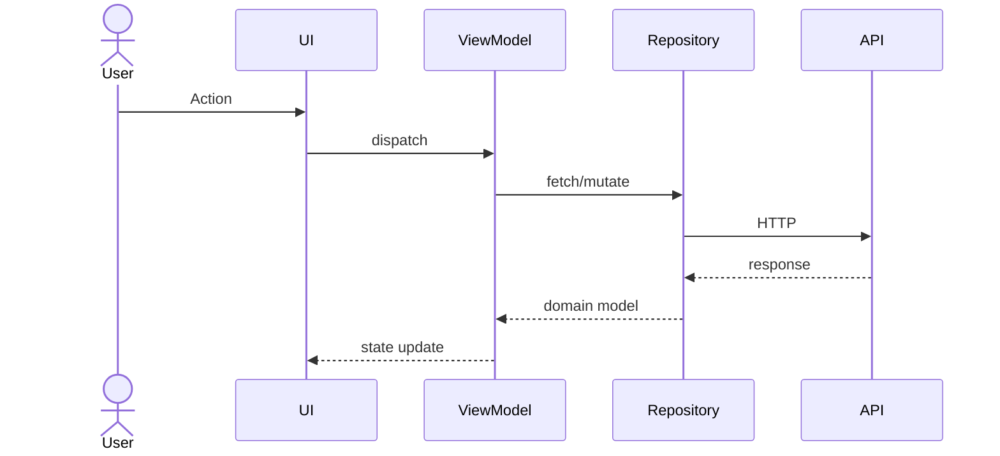

# Design — {{APP_NAME}}

## Goal
{{GOAL_PARAGRAPH}}

## Architecture overview

```mermaid
flowchart LR
    User((User)) --> Client[{{CLIENT_NAME}}]
    Client -->|HTTPS / tRPC / GraphQL| API[{{API_NAME}}]
    API --> DB[(Database)]
    API --> Cache[(Cache)]
    Client --> NativeBridge[Native Modules]
    NativeBridge --> OS[OS APIs]
```

## Modules

| Module | Responsibility | Tech | Path |
| --- | --- | --- | --- |
| {{MODULE_1}} | {{RESP_1}} | {{TECH_1}} | {{PATH_1}} |
| {{MODULE_2}} | {{RESP_2}} | {{TECH_2}} | {{PATH_2}} |

## Data flow



## State management
- **Strategy:** {{STATE_STRATEGY}} (Redux / Riverpod / SwiftUI @State+@Observable / Zustand / etc.)
- **Boundaries:** UI ↔ ViewModel ↔ Repository ↔ API
- **Persistence:** {{PERSISTENCE}}

## Native bridges (mobile only)
| Capability | iOS API | Android API | Bridge module |
| --- | --- | --- | --- |
| {{CAP_1}} | {{IOS_1}} | {{ANDROID_1}} | {{BRIDGE_1}} |

## Concurrency model
{{CONCURRENCY_NOTES}}

## Error & failure model
- All `Result<T, AppError>` boundaries documented in code
- Errors classified: `Network`, `Auth`, `Validation`, `Storage`, `Unknown`
- User-visible messages localized; technical detail logged to telemetry only

## Performance budgets
- Cold launch: ≤ 2.0s on mid-tier device
- 60 fps during all primary flows
- Time-to-interactive (web): ≤ 3.0s on 4G

## Security & privacy
- Auth: {{AUTH_SCHEME}}
- Secrets: never committed; sourced from {{SECRETS_SOURCE}}
- PII: {{PII_NOTES}}
- Telemetry opt-out respected

## Out of scope
{{OUT_OF_SCOPE}}

## Open questions
- {{Q_1}}
- {{Q_2}}
