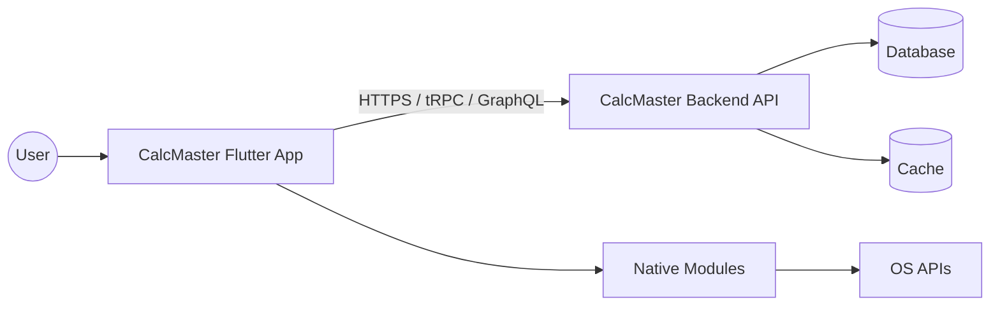
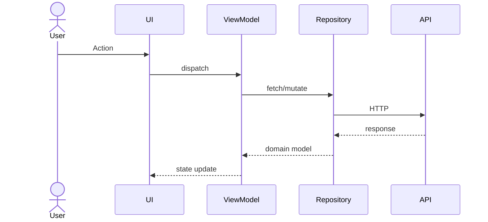

# Design — CalcMaster

## Goal
CalcMaster is a comprehensive, region-aware world calculator and converter designed to replace multiple utility apps with a single, fast, and privacy-first solution.

## Architecture overview

## Modules

| Module | Responsibility | Tech | Path |
| --- | --- | --- | --- |
| Convert | Unit conversion across 10 categories | Dart / Flutter | lib/lib_units.dart |
| Calculate | 5 calculation modes (standard, scientific, etc.) | Dart / Flutter | lib/lib_calc.dart |

## Data flow

## State management
- **Strategy:** Provider (ChangeNotifier) (Redux / Riverpod / SwiftUI @State+@Observable / Zustand / etc.)
- **Boundaries:** UI ↔ ViewModel ↔ Repository ↔ API
- **Persistence:** SharedPreferences (local) and PostgreSQL (backend)

## Native bridges (mobile only)
| Capability | iOS API | Android API | Bridge module |
| --- | --- | --- | --- |
| GPS Coordinates | CoreLocation | Google Play Services Location | geolocator package |

## Concurrency model
Concurrency is handled using Dart Async/Await and Future.wait for parallel requests.

## Error & failure model
- All `Result<T, AppError>` boundaries documented in code
- Errors classified: `Network`, `Auth`, `Validation`, `Storage`, `Unknown`
- User-visible messages localized; technical detail logged to telemetry only

## Performance budgets
- Cold launch: ≤ 2.0s on mid-tier device
- 60 fps during all primary flows
- Time-to-interactive (web): ≤ 3.0s on 4G

## Security & privacy
- Auth: JWT Bearer Token with MFA (TOTP)
- Secrets: never committed; sourced from Environment variables (.env for backend, MonetizationConfig for Flutter)
- PII: PII (emails, display names) is encrypted in transit and hashed in database where applicable.
- Telemetry opt-out respected

## Out of scope
Direct hardware integration beyond GPS, custom theme engines beyond dark/light modes.

## Open questions
- How will currency rates be updated?
- What is the fallback for offline usage?
